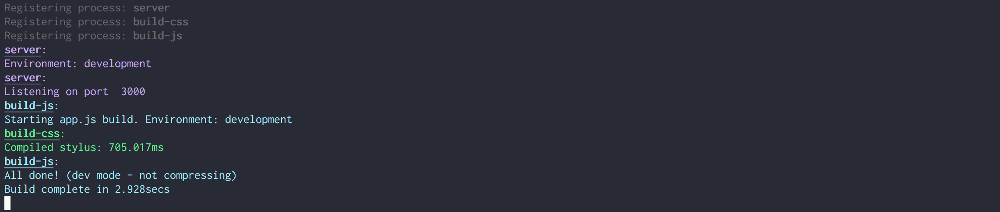

# Native Task Runner

This is an example of how you can structure a task runner without using
abstraction tools like gulp, webpack, and grunt. It can be less confusing, more
scalable, and infinitely more powerful to build a CLI specifically for your app.

_This doesn't do anything out of the box because it doesn't make any assumptions
about what technology you used in your application._

1. Rename bin/YOUR_APP_NAME to the name of your app.
2. Customize/remove/change the other build related commands in the bin
   directory.

See [bin/YOUR_APP_NAME](bin/YOUR_APP_NAME) for more details.
